# Production convergence design

## Boundary

This task joins four independently working surfaces without redesigning them:

1. Paper plugin (`src/main/java`, `src/main/resources`)
2. deterministic resource-pack/catalog assets (`site/scripts`, `site/public/downloads`)
3. Cloudflare Worker/D1/Durable Objects (`site/src`, `site/migrations`, `site/wrangler.jsonc`)
4. production runtime on `wlcb1`

Each surface keeps its current implementation boundary. Convergence is an artifact identity, rollout, rollback, and player-acceptance problem.

## Sources of truth

| Concern | Source of truth |
|---|---|
| Plugin behavior | Java source plus `src/main/resources/config.yml` and `plugin.yml` |
| Electricity/multiblock model | `docs/TalexSoulTech-体系化发展与电力系统重构说明.md` and `.trellis/spec/backend/system-invariants.md` |
| Public catalog/resource pack | deterministic output of `site/scripts/prepare-assets.mjs` and the generated manifest |
| SaaS schema | ordered SQL files under `site/migrations/` |
| Worker bindings/routes | `site/wrangler.jsonc` |
| Release identity | one receipt containing commit and every deployed artifact/revision hash |

Generated files do not become independent sources of truth. Regenerate them from the same source revision used for the release.

## Release flow

```mermaid
flowchart LR
    A[Attribute dirty paths] --> B[Freeze source revision]
    B --> C[Build JAR and resource pack]
    C --> D[Apply remote D1 migrations]
    D --> E[Deploy Worker]
    E --> F[Live SaaS E2E]
    F --> G[Atomic Paper cutover]
    G --> H[Paper and RCON smoke]
    H --> I[Real-player acceptance]
    I --> J[Balance report and Trellis closeout]
```

The flow is fail-closed. A failed stage blocks every later stage. Rollback returns the affected surface to the previous recorded artifact; it does not patch production in place.

## Data and isolation contracts

- Player persistence remains MySQL-owned by the Paper plugin. Disabled persistence is explicitly non-durable; failed loads must never overwrite existing rows with defaults.
- SaaS tenancy remains D1/Worker-owned. Every server mutation and snapshot is scoped by the authenticated administrator/server relationship.
- Sync sequence is monotonic per server. The Worker/DO accepts an ordered snapshot contract; plugin outbox bodies remain byte-exact across retries.
- Extension data remains per-extension and per-server. Script code receives bounded host capabilities, never raw database, filesystem, network, Bukkit, or credential access.
- Wilderness identity remains in bounded Chunk PDC v2 data. Current generation configuration cannot reinterpret old indexed blocks.

## Compatibility

- Build and runtime baseline: Java 25, Paper `26.1.2 build 74`.
- Plugin config additions are additive and fail closed. MySQL/cloud are disabled until complete configuration is present.
- Paper 26 CustomModelData uses string selectors; deprecated integer model IDs are not a compatibility fallback.
- Existing D1 migrations are immutable. New schema changes require a new ordered migration.

## Rollback

Before cutover, capture the currently running JAR, resource-pack URL/hash, Worker revision, D1 migration state, and relevant non-secret configuration. Paper rollback is an atomic artifact replacement followed by restart and RCON smoke. Worker rollback uses the previously recorded deployment revision. D1 migrations must be additive unless a separately reviewed rollback migration exists.

## Planning blockers

The release cannot start until the owner resolves the three open decisions in `prd.md`: dirty-path inclusion, release window/rollback tolerance, and early-game timing targets.
