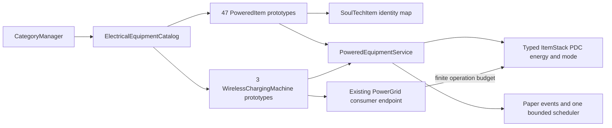
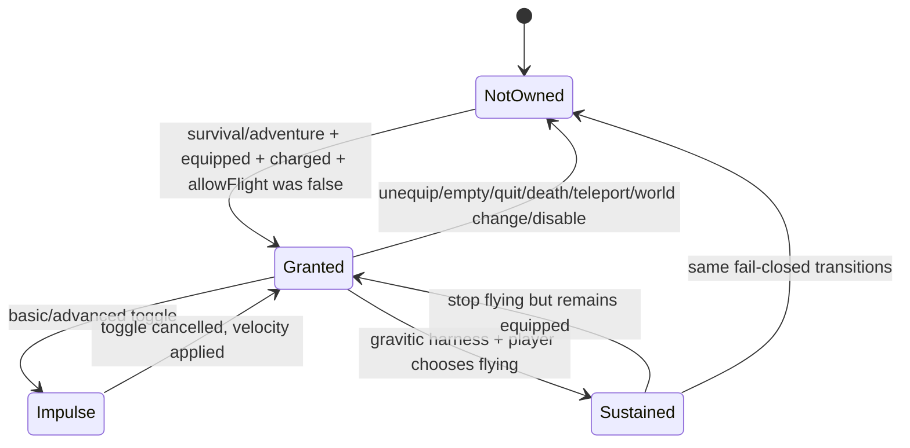

# Electrical equipment architecture

## 1. System shape



The catalog is the only place that defines count, IDs, tier, ability, material, capacity, cost, bounds, and upgrade relation. Event code switches on the catalog ability enum; no per-item listener or timer exists.

## 2. Core types

### `RechargeableItem`

A small contract implemented by all new portable items and the existing industrial energy cell:

```java
long energyCapacityMilliSe();
long maxReceiveMilliSe();
long maxExtractMilliSe();
```

### `PortableEnergyStorage`

The ItemStack boundary owns typed PDC keys and legacy migration:

```java
long stored(ItemStack stack);
long receive(ItemStack stack, long requested, boolean simulate);
long extract(ItemStack stack, long requested, boolean simulate);
int mode(ItemStack stack, int modeCount);
void setMode(ItemStack stack, int mode, int modeCount);
```

It first resolves `SoulTechItem.getItem(stack)` and requires `RechargeableItem`; display name/lore/material are never identity. `simulate=true` is read-only. Mutation clones the stack, rewrites the typed value, removes legacy string `chargeMilliSe`, refreshes energy/mode lore, and explicitly writes the replacement into its owning slot.

### Catalog records

`PoweredItemSpec` owns one portable item. `PoweredAbility` is exhaustive. `EquipmentCatalogContent` owns immutable tier slices and validates 47 portable + 3 machines, 24 active tools, globally unique IDs, valid upgrade order, and positive/bounded energy values.

`PoweredItem` is the single concrete portable prototype. Its existing `SoulTechItem` hooks delegate to `PoweredEquipmentService`; it does not allocate tasks or mutable per-player maps.

## 3. Event and periodic ownership

`PoweredEquipmentService implements Listener, AutoCloseable` and owns exactly one synchronous repeating task. Each cycle scans only main hand, off hand, and four armor slots for online players; inventory-wide scans occur only for an explicit charging operation and stop when the finite budget is exhausted.

Required event entry points:

- `PlayerInteractEvent`: modes, scanners, tilling, repair, personal transfer, recall, active utilities;
- `BlockBreakEvent` through `PoweredItem.useItemBreakBlock`: paid primary action and bounded secondary breaks;
- `EntityDamageByEntityEvent`: baton/cutter/stunner attacker behavior;
- `EntityDamageEvent`: powered armor, force field, fall mitigation;
- `PlayerToggleFlightEvent`: jetpack impulse and gravitic flight;
- quit/death/respawn/teleport/world-change: clear cooldown/flight state;
- plugin disable: cancel the one task, revoke only owned flight, clear UUID state.

Effects use UUID keys and monotonic service cycles, not player names or wall-clock cooldown maps.

## 4. Block action transaction

1. Existing `BlockListener` establishes PlayerData, protection, and managed-block priority.
2. Service validates ability, mode, target material, loaded chunk, target cap, and simulated energy.
3. Primary event remains the ordinary Paper event.
4. Secondary blocks call `Player.breakBlock` under a UUID recursion guard, so normal protection/drop/tool behavior fires.
5. Energy is extracted only after each successful secondary break; failed/cancelled breaks cost zero.
6. The guard suppresses another area expansion but does not bypass ordinary listeners.

No direct `Block#setType(AIR)` is allowed for mining tools.

## 5. Charging transaction

All transfers use the same two-sided transaction:

1. simulate target receive;
2. simulate source extract for the accepted amount;
3. execute source extract on a clone;
4. execute target receive on a clone;
5. write both owning slots exactly once after executed amounts agree.

Backpacks transfer only from the chest slot. Wireless receivers work only in the off hand. Machines receive a fixed output budget equal to the energy already consumed by the multiblock operation and distribute at most that budget across deterministic slots/players.

The old barrel charging station calls this same storage API. Its previous hard-coded 100 SE string-NBT branch is removed after legacy-read compatibility is in place.

## 6. Flight state machine



If `allowFlight` was already true, the service never records ownership and never revokes it. Creative/spectator modes are never modified. Basic and advanced jetpacks cancel actual flight and produce bounded velocity impulses; only the gravitic harness permits sustained flight and pays every service cycle while flying.

## 7. Recipes and registration

`CategoryManager.initMultiblockDisciplines` constructs industrial materials first, then one equipment catalog. Each T1-T5 slice is passed once to the existing `registerContent`, preserving recipe/category/powered-machine registration. Portable recipes are generated from tier templates and an optional prior item ID; all prerequisites already exist before `getRecipe()` runs.

Higher-tier crafting outputs the prototype at zero charge. This deliberately consumes but does not clone the input battery charge, preventing energy duplication in the advanced-workbench transaction.

## 8. Performance bounds

- periodic work: `O(online players × 6 fixed slots)` every service interval;
- station work: at most 1/4/8 nearby players, one finite inventory pass each, no offline or cross-world target;
- scan tools: loaded chunks only, explicit block sample/target caps;
- chain mining/tree felling: queue size capped by spec;
- entity tools: bounded radius and target count, never Player targets;
- no async Bukkit access, no forced chunks, no per-item tasks, no virtual PowerGrid endpoints for carried items.

## 9. Compatibility and lifecycle

- Legacy `industry_energy_cell` reads string `chargeMilliSe`; first successful mutation writes typed PDC and removes the string.
- Portable energy stays on ItemStack through ordinary inventory/server persistence; `PlayerData` remains unchanged.
- `TalexSoulTech.onEnable` creates the service before catalog construction, registers it after item setup, then starts its task.
- `onDisable` stops the service before electricity cleanup and static registry cleanup.
- Reload must not construct the catalog twice in one plugin generation; catalog validation detects duplicates before silent `SoulTechItem` overwrite.

## 10. Rollback

The change is additive except for the charging-station implementation and energy-cell compatibility adapter. Rollback uses the previous JAR. New items remain serialized ItemStacks with SoulTech identity/PDC; on the old JAR they are inert custom items rather than executing partial behavior. No database migration is involved.
