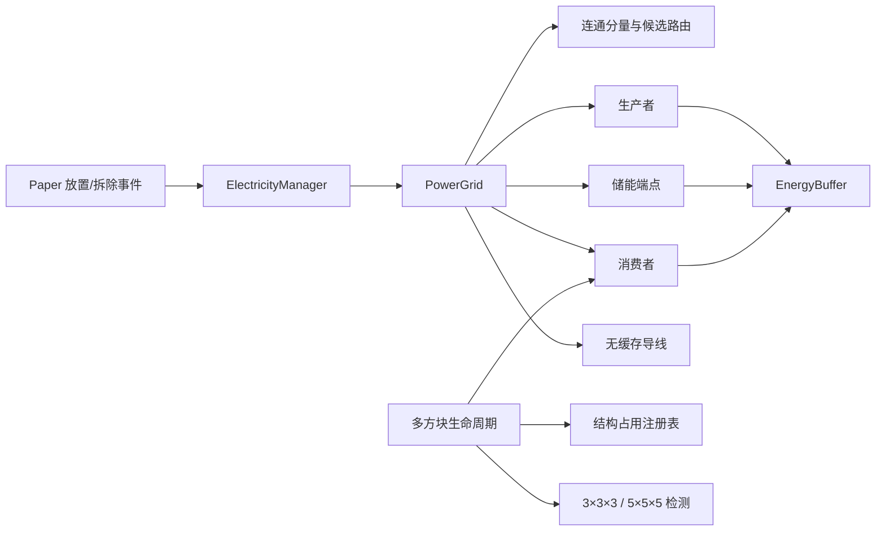
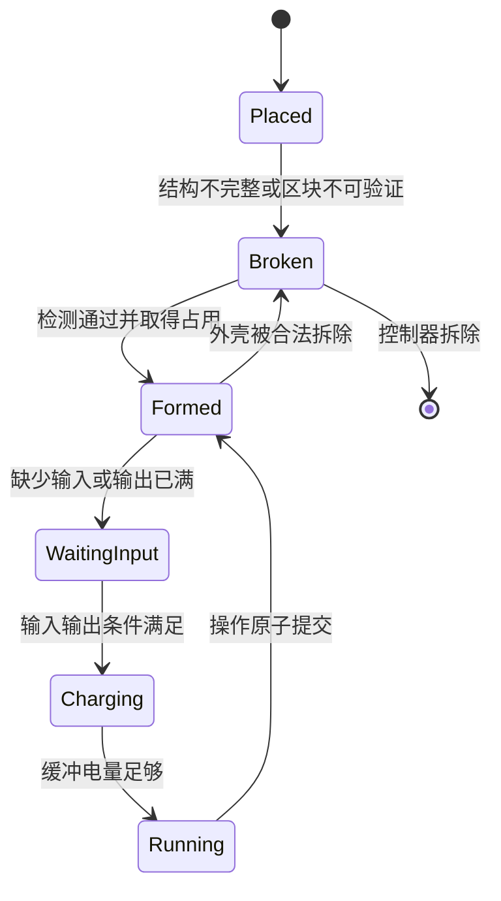

# TalexSoulTech 基础电力、多方块与学科内容实现说明

## 1. 当前结论

TalexSoulTech 已从旧的“每台发电机定时 DFS 扫描并直接推电”实现，切换为一套无电压、整数结算、主线程运行的基础电网。旧 `Capacity`、`PathAlgorithm`、`GlobalRunner`、`ElectricityAchiever`、`IReceiver` 与 `IWire` 链路已经删除，发电机、蓄电池、导线和新机器全部通过 `PowerEndpoint`、`PowerCable` 与 `PowerGrid` 运行。

新系统不模拟电压。电力只包含存量、容量、周期输入上限、周期输出上限、线路通量与线路损耗。这样保留了真实系统中的能量守恒、传输能力、线路损失、供需和储能调峰，同时避免玩家必须理解电压等级、变压器和烧机规则。

当前内容体系包含 30 台正式多方块机器：工业学 15 台，魔法学 5 台，空间学 5 台，引力学 5 台。控制器、配方、材料、便携道具、状态全息、粒子、声音、保存加载、所有者权限和结构占用均已接入统一框架。

## 2. 电网总体架构



核心代码位于：

- `src/main/java/pubsher/talexsoultech/talex/electricity/EnergyBuffer.java`
- `src/main/java/pubsher/talexsoultech/talex/electricity/PowerGrid.java`
- `src/main/java/pubsher/talexsoultech/talex/electricity/PowerEndpoint.java`
- `src/main/java/pubsher/talexsoultech/talex/electricity/PowerCable.java`
- `src/main/java/pubsher/talexsoultech/talex/managers/ElectricityManager.java`

`ElectricityManager` 是唯一 Paper 调度入口，每 2 tick 在主线程运行一个电力周期。它不异步访问方块、库存、实体、粒子或普通 `HashMap`。端点注册和注销也只能发生在主线程，重复坐标会直接拒绝，而不是静默覆盖原设备。

## 3. 电量模型如何保证正确

领域层使用 `long` 毫 SE：`1 SE = 1000 milli-SE`。界面显示时才转换成小数。整数模型不会产生 `double` 多次累加后的舍入漂移，也不会通过 `-0.0`、`NaN` 或负请求破坏库存。

`EnergyBuffer` 只提供两个有界操作：

```java
long accepted = buffer.receive(requested, simulate);
long extracted = buffer.extract(requested, simulate);
```

`simulate=true` 只返回“可以接收或提取多少”，不修改状态；`simulate=false` 才提交。所有输入必须非负，且始终满足：

$$
0 \le stored \le capacity
$$

一次线路传输还必须满足：

$$
sourceDebit = targetDelivery + lineLoss
$$

满电接收端不会从源端扣电；供电不足会部分交付；损耗不会产生负交付；高损耗线路会选择满足目标交付所需的最小源端扣量，不会在同一交付平台上浪费额外能量。

这一接口参考了 Forge `IEnergyStorage` 的 receive/extract + simulate 契约，并采用 Mekanism 的长整数、先模拟后执行和网络流量统计思路：

- [Forge IEnergyStorage](https://github.com/MinecraftForge/MinecraftForge/blob/4dae9908803850c7c305b73c1c3916f7f4b4a637/src/main/java/net/minecraftforge/energy/IEnergyStorage.java)
- [Mekanism EnergyNetwork](https://github.com/mekanism/Mekanism/blob/master/src/main/java/mekanism/common/content/network/EnergyNetwork.java)

## 4. 拓扑、路由与公平分配

设备和导线以 `BlockKey(world UUID, x, y, z)` 注册。只有六个正交相邻方块可以连接。拓扑仅在放置、拆除或恢复节点时重建，不再由每台发电机每 5 tick 重复扫描世界。

每个连通分量最多允许 4096 个节点。超限网络会停止结算并进入统计，而不是继续递归、栈溢出或拖垮主线程。图搜索使用非递归队列。

路由按累计线路损耗优先、方块步数次优。一个源和目标可以缓存多条候选路线。首选线路饱和后，系统只对剩余网络执行残量搜索，并缓存新路线；稳态不需要每个源—目标组合每周期完整 Dijkstra。完全不能交付净电量的残余路径会被跳过，系统继续寻找可交付的并行路径。

消费者先于储能充电获得电量。供给侧先使用发电机，发电不足时才由储能补缺。某个储能在一个周期内一旦放电，就不会在同周期重新充电。相同优先级的消费者使用全局周期游标轮转；即使无关网络发生拓扑重建，也不会把公平顺序重置到固定低坐标设备。

导线不缓存电量。铁质导线当前提供每周期 50 SE 的共享通量，并按每段 0.5% 计算损耗。分支路径共享经过的每一段导线预算，因此不能通过多个接收器重复使用同一线路上限。

该拓扑变更、网络合并/拆分和服务端线程约束参考了 Immersive Engineering 的线网设计：

- [Immersive Engineering GlobalWireNetwork](https://github.com/BluSunrize/ImmersiveEngineering/blob/master/src/api/java/blusunrize/immersiveengineering/api/wires/GlobalWireNetwork.java)

## 5. 发电、储能与燃料

火力发电机拥有 500 SE 缓冲、每周期 10 SE 输出上限，实际燃料转化速度为每电力周期 0.25 SE。燃料总时长直接读取 Paper `ItemType#getBurnDuration()`，因此原版可用熔炉燃料无需手写枚举，煤炭块也不会因为整数除法变成无限燃料。

- [Paper ItemType#getBurnDuration](https://jd.papermc.io/paper/26.2/org/bukkit/inventory/ItemType.html#getBurnDuration())

基础蓄电池拥有 1500 SE 缓冲和每周期 30 SE 双向通量。它既可以接收富余发电，也可以在发电不足时补充消费者，但不会在同一周期同时充放电。

火力机、蓄电池与导线恢复时不会强制加载所有历史区块。未加载设备保留领域状态，在对应区块自然加载后恢复方块验证和全息显示。拆除时会原子注销端点并删除全息，避免幽灵设备。

## 6. 多方块检测模块

多方块代码位于：

- `talex/multiblock/MultiblockTemplate.java`
- `talex/multiblock/MultiblockTemplates.java`
- `talex/multiblock/MultiblockDetector.java`
- `talex/multiblock/MultiblockStructureRegistry.java`
- `talex/machine/multiblock/PoweredMultiblockMachineItem.java`
- `listener/MultiblockProtectionListener.java`

控制器位于结构正面底层中心。玩家放置控制器时的朝向决定结构朝向，本地坐标会旋转到 NORTH、SOUTH、EAST 或 WEST。控制器外侧可以直接连接导线。

### 6.1 3×3×3 紧凑结构

3×3×3 模板占用完整 27 格。控制器之外的 26 格由外壳、观察窗、空气内腔和中心能量核心构成：

- 外壳允许铁块、铜块或涂蜡铜块。
- 观察窗允许玻璃、遮光玻璃或铁栏杆。
- 中心核心为红石块。
- 内腔必须为空气。

### 6.2 5×5×5 工业结构

5×5×5 模板占用完整 125 格。控制器之外的 124 格同样全部检查：

- 外壳允许铁块、切制铜块或涂蜡切制铜块。
- 观察窗允许玻璃、遮光玻璃或铁栏杆。
- 中心核心为磁石。
- 其余内腔必须为空气。

### 6.3 检测与占用语义

检测器只读世界，不自动补方块、不爆炸、不强制加载区块。SHIFT 右键控制器会重新检查，并用粒子标记前八个错误位置。

一个完整结构会向 `MultiblockStructureRegistry` 原子声明全部方块。两个控制器不能共享外壳、核心或内腔。冲突控制器保持停机并周期重试；原控制器拆除后，候选控制器可以自动取得结构。重启时会先恢复上次声明赢家，防止加载顺序反转所有权。

区块卸载属于“暂不可验证”，不是“结构损坏”。系统会暂停机器，但保留原占用；区块重新加载后自动恢复。活塞、爆炸和未授权玩家不能破坏已声明结构，漏斗不能直接绕过权限抽取控制器桶。跨机器自动化应使用正式空间路由器。

所有权使用玩家 UUID 持久化，名字只作为旧数据迁移字段。机器访问、拆除、相位钥匙、自动采矿监督和物品来源筛选均以 UUID 为准。

## 7. 统一机器生命周期

`PoweredMultiblockMachineItem` 封装了所有公共行为：



每台机器的 `process(machine, true)` 必须纯模拟。框架确认输入、输出空间和世界条件后才消耗本周期能量、推进进度；达到操作周期后调用 `process(machine, false)` 原子提交。`MachineInventoryOps` 通过克隆库存快照，先消耗输入、再模拟堆叠与空槽，全部成功后一次性 `setContents`。因此满输出不会吞输入，模拟不会修改库存。

保存格式记录控制器位置、朝向、毫 SE 电量、进度、状态、UUID 所有者、primitive meta 和结构声明状态。插件关闭顺序是：停止电网周期、保存所有机器和导线、保存方块映射、再在 `finally` 清空电网与结构静态注册表。即使保存异常，同类加载器重新启用也不会留下旧端点。

## 8. 工业学：15 台机器

| 机器 | ID | 结构 | 核心行为 |
|---|---|---:|---|
| 工业粉碎机 | `industry_crusher` | 3³ | 未分选矿石转为粉碎矿料 |
| 洗矿机 | `industry_ore_washer` | 3³ | 粉碎矿料与水洗选为精矿 |
| 离心机 | `industry_centrifuge` | 3³ | 洗选精矿分离为富集精矿与副产物 |
| 电炉 | `industry_electric_furnace` | 5³ | 富集精矿冶炼为工业精炼锭 |
| 压缩机 | `industry_compressor` | 3³ | 精炼锭压制为工业板材 |
| 合金炉 | `industry_alloy_furnace` | 5³ | 精炼材料与添加剂生成工业合金 |
| 地质扫描仪 | `industry_geological_scanner` | 3³ | 消耗纸张，对已加载范围生成矿物报告 |
| 自动采矿机 | `industry_automatic_miner` | 5³ | 有界搜索已加载矿层，监督者在场时安全采矿 |
| 岩石破碎机 | `industry_rock_crusher` | 3³ | 石料转为碎石、砂与石粉链 |
| 化学反应器 | `industry_chemical_reactor` | 5³ | 石粉等材料合成为化学浆料 |
| 电解机 | `industry_electrolyzer` | 5³ | 化学浆料转为工业电解质 |
| 流体泵 | `industry_fluid_pump` | 3³ | 空桶提取已加载、允许修改的水或岩浆源 |
| 精密组装机 | `industry_precision_assembler` | 5³ | 合金、板材与电解质生成精密模块 |
| 充能站 | `industry_charging_station` | 3³ | 为单个便携能量单元写入 `chargeMilliSe` |
| 回收机 | `industry_recycler` | 3³ | 将受支持废料原子回收为基础工业材料 |

工业主链为：

```text
钻头 → 自动采矿 → 未分选矿石 → 粉碎 → 洗矿 → 离心
    → 富集精矿 → 电炉 → 精炼锭
    ├─ 压缩 → 板材 ─┐
    ├─ 合金炉 → 合金 ├─ 精密组装 → 精密模块
    └─ 化学/电解 ───┘
```

工业学注册 13 种稳定材料与道具，包括未分选矿石、粉碎矿料、洗选精矿、富集精矿、精炼锭、板材、合金、石粉、化学浆料、电解质、精密模块、能量单元和便携钻头。钻头配方只依赖已有电线、电路板和原版材料，不产生启动循环；堆叠能量单元不能整体共享一个充能 NBT。

## 9. 魔法学：5 台机器

| 机器 | ID | 结构 | 核心行为 |
|---|---|---:|---|
| 魔法共振阵列 | `magic_resonance_array` | 3³ | 生成共振尘 |
| 虚空蒸馏器 | `magic_void_distiller` | 3³ | 共振尘蒸馏为以太晶体 |
| 元素灌注祭坛 | `magic_elemental_infusion_altar` | 5³ | 晶体与既有魔法材料生成元素印记 |
| 星界织机 | `magic_astral_loom` | 5³ | 元素印记与纤维生成法术核心 |
| 回响之门 | `magic_echo_gate` | 5³ | 法术核心生成裂隙罗盘与星界透镜 |

材料链为“共振尘 → 以太晶体 → 元素印记 → 法术核心 → 裂隙罗盘/星界透镜”。便携道具只在主线程、已加载区块和有限半径运行，跳过玩家，不伤害或移动玩家。

## 10. 空间学：5 台机器

| 机器 | ID | 结构 | 核心行为 |
|---|---|---:|---|
| 空间物品分类器 | `space_item_router` | 3³ | 按路由卡、SoulTech ID 和稳定材质将物品送往相邻容器 |
| 折叠仓储核心 | `folded_storage_core` | 5³ | 在物理相邻容器间执行有界稳定分片 |
| 相位传送器 | `phase_transmitter` | 5³ | 同世界、已加载、256 格内以互反 UUID 钥匙成对传送 |
| 空间压缩器 | `space_compressor` | 3³ | 执行木材、原木、木棍等 9:1 压缩链 |
| 维度锚定器 | `dimensional_anchor` | 5³ | 不强载区块，只处理已加载范围内所有者物品 |

空间材料链使用稳定 SoulTech 身份：`SpaceDust + EndStoneDust → PhaseCrystal`，再由相位晶体、电路板和火焰锭块生成量子存储体，继续制作锚定碎片、空间路由卡和相位传送钥匙。分类器满目标时保留源物品，不允许 DROP/VOID 回退。

## 11. 引力学：5 台机器

| 机器 | ID | 结构 | 核心行为 |
|---|---|---:|---|
| 引力吸引器 | `gravity_attractor` | 3³ | 有界吸引最多指定数量的敌对生物 |
| 引力排斥器 | `gravity_repulsor` | 3³ | 有界排斥敌对生物 |
| 物品吸积器 | `item_accretion_machine` | 3³ | 原子吸收所有者掉落物，满仓不删除实体 |
| 引力分离器 | `gravity_separator` | 3³ | 原版材料生成引力通量 |
| 奇点压缩机 | `singularity_compressor` | 5³ | 通量与压缩质量生成引力核心 |

引力效果永远跳过玩家、盔甲架和不符合条件的实体，限制半径、目标数量和最大速度，预测目标位置必须仍在已加载区块。物品吸积先模拟库存插入，成功后才移除实体。

引力材料包括引力通量、压缩质量和引力核心；便携道具包括引力脉冲发射器和惯性锚。便携效果带冷却、有限半径和玩家排除规则。

## 12. 如何新增一台机器

### 12.1 定义规格

```java
private static final PoweredMachineSpec SPEC = PoweredMachineSpec.of(
        "example_machine",
        "§b示例机器",
        MultiblockTemplates.compact3x3x3(),
        200,   // 缓冲 SE
        24,    // 每周期最大输入 SE
        6,     // 每工作周期耗能 SE
        8,     // 完成一次操作所需周期
        Particle.ELECTRIC_SPARK,
        Sound.BLOCK_BEACON_AMBIENT,
        "§7机器用途说明"
);
```

`energyPerWorkCycle` 是每个进度周期消耗量，总操作耗能为它乘以 `operationCycles`。机器缓冲必须至少容纳一个工作周期耗能。

### 12.2 实现纯模拟与提交

```java
public final class ExampleMachine extends PoweredMultiblockMachineItem {
    public ExampleMachine() {
        super(SPEC);
    }

    @Override
    protected boolean process(RuntimeMachine machine, boolean simulate) {
        Inventory inventory = machine.inventory();
        if (inventory == null) return false;

        return MachineInventoryOps.transform(
                inventory,
                List.of(MachineInventoryOps.ingredient(
                        new ItemStack(Material.RAW_IRON), 1)),
                List.of(new ItemStack(Material.IRON_INGOT, 2)),
                simulate
        );
    }
}
```

`simulate=true` 不得播放声音、生成粒子、移动实体、修改方块、修改 meta 或修改库存。所有副作用必须放在 `simulate=false` 分支。世界型机器还必须检查区块已加载、范围有上限、每次目标数量有上限、所有者或管理员授权，并永远跳过玩家。

### 12.3 注册目录

机器类必须具有公开无参构造，便于 `Class.forName(...).getDeclaredConstructor().newInstance()` 恢复。目录方法每次创建 fresh list，但 `CategoryManager` 只能调用一次：

```java
public static List<PoweredMultiblockMachineItem> machines() {
    return List.of(new ExampleMachine());
}
```

材料与便携道具在 `items()` 中先构造，机器在 `machines()` 中后构造。运行时通过稳定 `soul_tech_item_id` 解析，不使用单纯 Material 冒充自定义材料。

## 13. 关键安全边界

- Paper 世界、方块、库存、实体、全息、粒子和声音只在主线程访问。
- 放置使用 `BlockPlaceEvent#getItemInHand()`，取消事件不会登记 `TalexBlock` 或电网端点。
- 玩家数据未发布时取消自定义机器放置和破坏。
- 管理方块的拆除生命周期优先于手持自定义工具，避免只删 BlockManager 而遗漏端点。
- 控制器所有权保存 UUID；管理员权限为 `talex.soultech.admin`。
- 控制器桶禁止外部 InventoryMoveItemEvent，正式物流通过空间学机器完成。
- 已声明结构阻止未授权破坏、活塞移动和爆炸破坏。
- 区块未加载不会触发同步强载，也不会释放已有结构占用。
- 保存失败仍在 `finally` 清空静态电网和结构注册表。

## 14. 便携电力装备与无线充电

新装备不建立第二套电网。47 件便携物品把电量保存在自身 ItemStack typed PDC 中；已有 `industry_energy_cell` 也接入同一契约并兼容迁移旧 `chargeMilliSe`。3 台无线充电设备仍是普通 `PowerGrid` 消费端点，每次只分配已经从机器缓冲扣除的有限预算。

所有便携装备强制单堆叠。电量使用 `long` milli-SE，`PortableEnergyStorage.receive/extract(..., simulate)` 与 `EnergyBuffer` 保持同一语义。实际修改返回 clone，调用方只在模拟成功后回填所属槽位，因此不会让一叠物品共享电量，也不会在双向转移中复制能量。

运行时只有一个 `PoweredEquipmentService` 主线程任务。周期工作只检查在线玩家的主手、副手和四个护甲槽；范围工具、实体目标、连锁方块和无线玩家数都有上限，且不强制加载区块。

| # | 阶段 | 装备 | ID | 主要作用 |
|---:|---:|---|---|---|
| 1 | T1 | 动力扳手 | `powered_wrench` | 旋转可定向方块并查看电力端点状态 |
| 2 | T1 | 电动钻机 | `electric_drill` | 单块无耐久电力采掘 |
| 3 | T1 | 电动链锯 | `electric_saw` | 连锁处理最多 8 个原木 |
| 4 | T1 | 电动铲 | `electric_shovel` | 直线处理最多 3 个松软方块 |
| 5 | T1 | 电动锄 | `electric_hoe` | 3×3 有界耕地 |
| 6 | T1 | 电动剪 | `electric_shears` | 3×3 树叶、蛛网和羊毛处理 |
| 7 | T1 | 矿物扫描仪 | `ore_scanner` | 扫描已加载范围并报告最近矿物 |
| 8 | T1 | 电动树脂采集器 | `resin_tapper` | 从原木提取现有工业树脂，带 UUID 冷却 |
| 9 | T1 | 袖珍电池 | `pocket_battery` | 第一阶便携储能 |
| 10 | T1 | 个人充电器 | `personal_charger` | 输入/输出双模式，在主副手之间转移电量 |
| 11 | T2 | 精密钻机 | `precision_drill` | 沿视线打通最多 3 个有效方块 |
| 12 | T2 | 电动开掘锤 | `excavation_hammer` | 按视面执行 3×3 开掘 |
| 13 | T2 | 伐木动力斧 | `lumber_axe` | 连锁砍伐最多 32 个原木 |
| 14 | T2 | 电动收割器 | `crop_harvester` | 3×3 成熟作物收割并原位补种 |
| 15 | T2 | 矿脉采掘器 | `vein_miner` | 最多 16 个相连同类矿石 |
| 16 | T2 | 磁力收集器 | `magnetic_collector` | 拉近最多 16 个物品实体 |
| 17 | T2 | 维修焊枪 | `repair_welder` | 修复副手物品，单次最多 64 耐久 |
| 18 | T2 | 场域照明器 | `field_flashlight` | 开关模式；持有时提供有耗能夜视 |
| 19 | T2 | 压缩电池 | `compact_battery` | 袖珍电池容量与传输升级 |
| 20 | T2 | 能量背包 | `energy_backpack` | 胸甲槽中给固定装备槽供能 |
| 21 | T3 | 采矿激光 | `mining_laser` | 视线方向采掘最多 8 个方块 |
| 22 | T3 | 等离子切割器 | `plasma_cutter` | 精确切割并提供非玩家目标电浆伤害 |
| 23 | T3 | 电弧焊机 | `arc_welder` | 依次维修副手与四件护甲 |
| 24 | T3 | 地形压实器 | `terrain_compactor` | 5×5 表面松软方块处理 |
| 25 | T3 | 地质分析仪 | `geological_analyzer` | 报告目标方块与有界矿物组成 |
| 26 | T3 | 生物电击器 | `mob_stunner` | 使一个非玩家目标减速并虚弱 |
| 27 | T3 | 震荡警棍 | `shock_baton` | 近战追加电伤害、击退与冷却 |
| 28 | T3 | 全能物质工具 | `universal_matter_tool` | 镐/斧/铲/锄/剪五模式 3×3 工作 |
| 29 | T3 | 高级电池 | `advanced_battery` | 压缩电池的高容量升级 |
| 30 | T3 | 电容背包 | `capacitor_backpack` | 能量背包的高速升级 |
| 31 | T1 | 动力靴 | `powered_boots` | 移动时提供速度与跳跃 |
| 32 | T2 | 磁稳靴 | `magnetic_boots` | 缓降并以电量抵消摔落伤害 |
| 33 | T2 | 伺服护腿 | `servo_leggings` | 移动时提供速度 |
| 34 | T3 | 动能护腿 | `kinetic_leggings` | 冲刺时提供更高速度与跳跃 |
| 35 | T2 | 动力胸甲 | `powered_chestplate` | 按实际减伤量扣能 |
| 36 | T3 | 护盾胸甲 | `shield_chestplate` | 更高比例减伤并削弱后续击退 |
| 37 | T1 | 侦察头盔 | `scout_helmet` | 有耗能夜视与电量提示 |
| 38 | T2 | 采矿头盔 | `mining_helmet` | 有耗能夜视与急迫 |
| 39 | T3 | 喷气背包 | `jetpack` | 双击飞行键产生一次受控推进 |
| 40 | T4 | 高级喷气背包 | `advanced_jetpack` | 推进/悬停双模式，不提供免费持续飞行 |
| 41 | T5 | 引力飞行背带 | `gravitic_harness` | 服务拥有且逐周期扣能的持续飞行 |
| 42 | T4 | 精英电池 | `elite_battery` | 高级电池终阶升级 |
| 43 | T4 | 感应能量背包 | `induction_backpack` | 按固定优先级高速供能 |
| 44 | T5 | 量子能量背包 | `quantum_energy_backpack` | 大容量终阶背包，仍受周期传输上限约束 |
| 45 | T3 | 无线充电接收器 | `wireless_charge_receiver` | 副手携带时接收远距站点能量并转发 |
| 46 | T4 | 个人力场发生器 | `field_generator` | 开关模式；按实际减伤量扣能 |
| 47 | T5 | 相位召回器 | `phase_recall_device` | 召回到已加载且可站立的出生点 |
| 48 | T2 | 感应充电台 | `wireless_charge_pad` | 3×3×3、半径 2、最多服务 1 名玩家 |
| 49 | T4 | 范围充电信标 | `area_charge_beacon` | 5×5×5、半径 12、最多 4 名接收器玩家 |
| 50 | T5 | 量子充电塔 | `quantum_charge_pylon` | 5×5×5、半径 32、最多 8 名接收器玩家 |

附加安全语义：方块工具先让原始 `BlockBreakEvent` 完成取消/保护判定，再在 `MONITOR` 观察到成功后扣除主块能量；附属方块通过 `Player.breakBlock` 重新进入正常破坏链，并用 UUID 递归守卫禁止再次展开范围。喷气背包只提供推进，引力背带才持有持续飞行；服务只撤销自己授予的 `allowFlight`，不会关闭创造/旁路插件已有的飞行权限。

## 15. 验证结果

领域测试位于：

- `src/test/java/pubsher/talexsoultech/domain/PowerGridDomainTest.java`
- `src/test/java/pubsher/talexsoultech/domain/MultiblockDomainTest.java`
- `src/test/java/pubsher/talexsoultech/domain/ElectricalEquipmentCatalogTest.java`

电网测试覆盖有界缓冲、负量拒绝、模拟不变、无损守恒、逐段损耗、共享通量、公平轮转、拓扑重建后公平、多源与储能优先级、同周期不充放、拓扑拆分、超限停机、重复坐标、并行线路、零净交付残量绕行和 999‰ 高损耗最小扣量。多方块测试覆盖 3³/5³ 完整体积、原子占用冲突与释放重领。电力装备测试覆盖 47/3/50 目录形状、24 个主动工具、唯一 ID、升级拓扑、五级覆盖、规格 fail-fast、无线预算整除/守恒、便携 receive/extract/transfer、20 SE 等离子攻击、8/32 耐久维修粒度、最终伤害计费与加载前置守卫。

最终 Java 25 Maven 验证结果：56 项测试全部通过。`mvn package` 生成：

```text
target/talex-soul-tech-3.0.0-SNAPSHOT.jar
```

制品 SHA-256：`3aa8dfbe3a487a977de844fb3d286913e6ab0d66c6866e73d5f377904a05c7bb`；同一制品已同步至官网与 `wlcb1` 生产插件路径。

候选包已在隔离的 Paper 26.1.2 build 74 / Java 25 服务器中实际启动。已观察到：

- `[TST] Loading server plugin TalexSoulTech`
- `[TST] Enabling TalexSoulTech`
- `[TST] Electrical equipment catalog ready: 47 portable, 3 wireless, 24 active tools.`
- `[TST] Machine catalog ready: 38 total (legacy=5, powered-multiblock=33); electricity grid active.`
- Paper `Done (...)`
- 电网周期观察窗口无 `Electricity cycle failed`、异常或错误
- 控制台 `stop` 后 TalexSoulTech 正常禁用、保存并以退出码 0 结束

2026-08-25 最终验收还完成了真实客户端逐件发放 50 项电力目录、向导领取/右键引导、铜/铁/虚空箱放置与权限、八项 16×16 自定义纹理、荒野 v2 新区块生成/消费/历史索引兼容、自然怪物白名单、3³/5³ 结构事务/重启/回收/重建。100 个新区块生成时 TPS 保持 `20.0`，1 分钟窗口最大 MSPT 为 `20.3 ms`，稳态最大 MSPT 为 `2.7 ms`。Cloudflare Worker 版本为 `bb11bf55-60d7-48b1-8b18-121cf7145bb0`，资源包 SHA-256 为 `20f8d355ea8906864cc324f0c93a1be4a9286abefd2ab9e2b982360807691d86`。

构建仍包含仓库既有的 Paper 弃用警告，如旧粒子库的 `org.bukkit.util.Consumer` 与旧魔法实体效果。这些警告未阻断本次电网、多方块、33 台供电多方块与 47 件便携电力装备，但后续 Paper 大版本升级前需要单独迁移。
